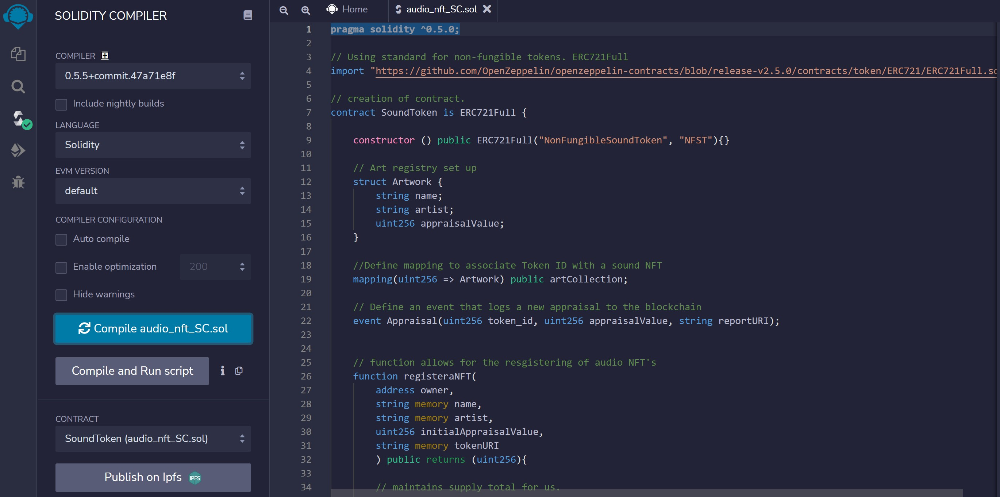
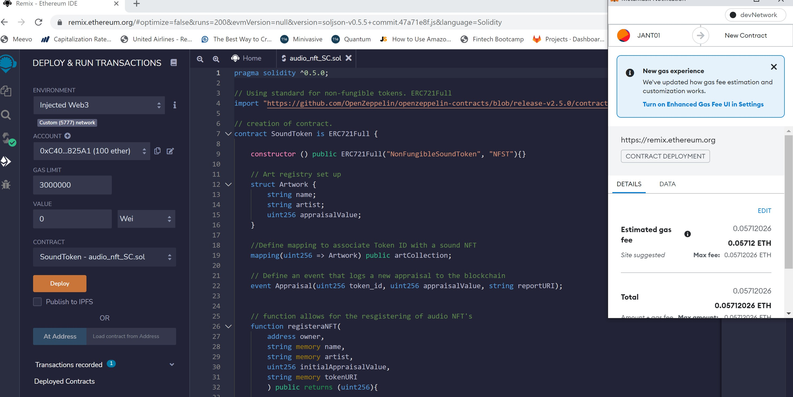
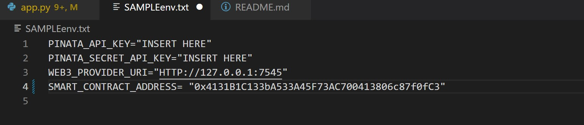

# Just Audio Non-Fungible Tokens (JANT)

The world's attention span seems to be shrinking. People are gravitating towards ever quicker burts of entertainment. There has also been an explosion in interest in Non-fungible tokens on the blockchain. JANT is looking for opporunities to leverage this momentum, and created a new ultra short form audio NFT which currently doesn't exist in the marketplace. The purpose of JANT is to host a streamlit web app to allow users to register, collect, and view sound NFT's. 
    
---

## Technologies

This analysis leverages Solidity (pragma ^0.5.5) and utilizes Remix IDE, Metamask, and Ganache to build and test smart contracts.
The following python libraries should also be installed in the enviromenet from which you run the app.py file:
web3
pathlib
dotenv
streamlit
pinata
multiprocessing
streamlit-authenticator
qrcode
st_aggrid
numpy
base 64


---

## Installation Guide

Install the Metamask browser extension and Ganache before running this program.

---

## Usage
The challenge is hosted on the following GitHub repository at: https://github.com/nguyenthuyt/audio_nft   

### **Run instructions:**
To run this project, simply clone the repository or download the files. Open a Remix IDE web browser instance and navigate to the directory that contains the following files:
**app.py**


and deploy the following contract:
**audio_nft_sc**

## Remix IDE Deployment
To compile and deploy the file using the following steps:

- Select the Injected Web3 environment
- From the Contract menu, select the audio_nft_sc contract
- Compile and deploy the contract



- An instance of Metamask will appear asking to confirm the transaction. Click confirm to proceed.



## Populate .env file

- Navigate to SAMPLE.env and populate with the deployed contract address from Remix IDE. Also, fill in Pinata API information and Ganache RPC URL.



## Streamlit Demo

In the terminal, type ```Streamlit run app.py```

Click link for demo video.


## Conclusion and Next Steps

Our app.py file in its current form has acheived the goal of creating sound-based NFTs. We have sucessfully hosted a streamlit-based platform for creating, storing, viewing, playing and collecting audio NFTs.

The next stage of development would involve migrating to a cloud hosted website. We would also look to deploy the Audio NFT smart contract to the Ethereum Mainnet. Additional development will be required to hard-limit the length of uploaded sound files to 5 seconds, as well as build out a connection to OpenSea which would allow our NFTs to be traded on the marketplace.

---

## Contributors

This project was created as part of the Rice Fintech Bootcamp 2022 Program by:

Jas Pinglia - https://github.com/jpinglia ; https://www.linkedin.com/in/JPinglia

Angela Richter - https://github.com/angie0920 ; https://www.linkedin.com/in/angela-richter-55017233

Neil Mendelow - https://github.com/nmendelow ; https://www.linkedin.com/in/neil-mendelow/ 

Thuy Nguyen - https://github.com/nguyenthuyt ; https://linkedin.com/in/nguyenthuyt


---

## License

MIT


